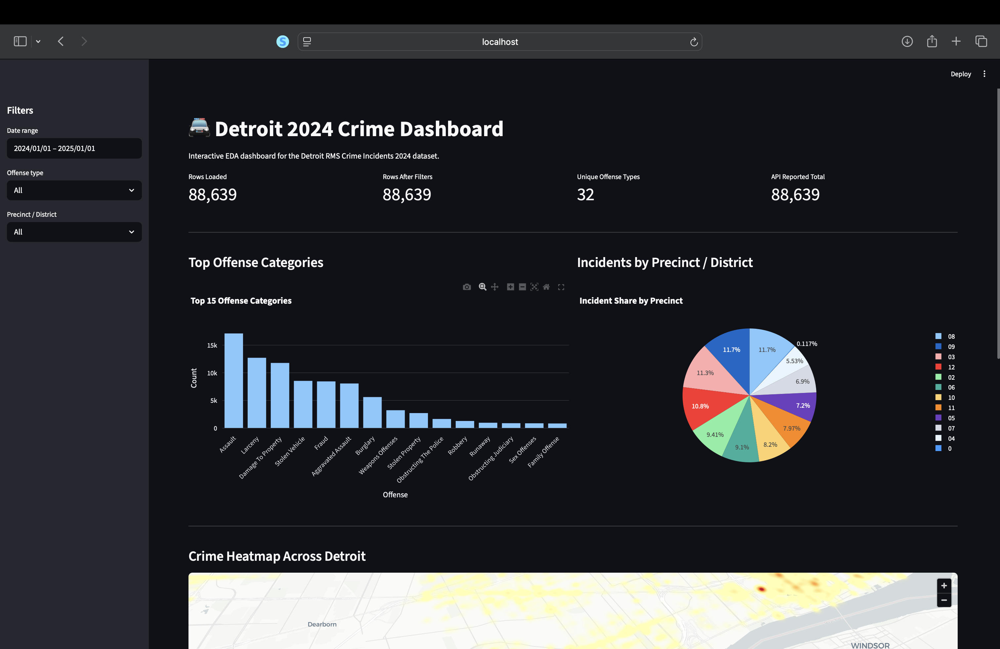
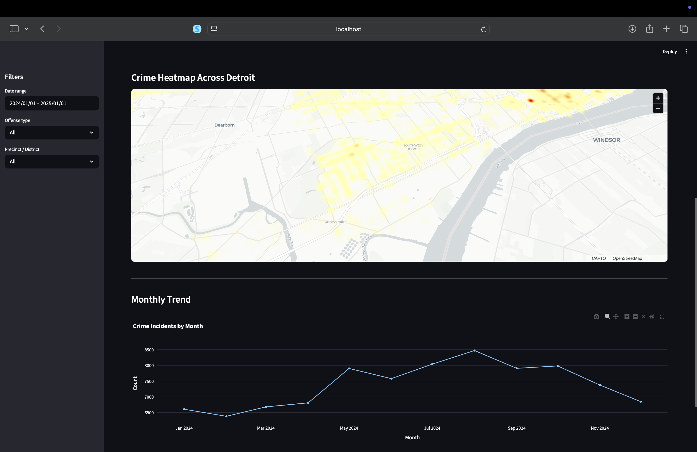

# Detroit 2024 Crime Dashboard

An interactive EDA dashboard for the Detroit RMS Crime Incidents 2024 dataset, built with Python and Streamlit. The app pulls live crime records from the Detroit open data API, runs them through an ETL pipeline into a Postgres database, and displays charts, maps, and spatial statistics that can be filtered through a sidebar.

## Team Members

| Name | Contribution |
|---|---|
| Aidan Villarreal | Data extraction pipeline, API integration, and pagination logic |
| Aryan Chaubey | Streamlit dashboard, data visualizations, spatial autocorrelation analysis, and README documentation |
| Bernardo Guerra | Docker setup, docker-compose configuration, and Postgres database integration |
| Tobin Reynolds | Data transformation, loading pipeline, and .env configuration |

## How to Run

Make sure Docker and Docker Compose are installed, then run:

```bash
docker-compose up --build
```

This will:
1. Start a Postgres database
2. Run the ETL pipeline (extract from API, transform, load into Postgres)
3. Launch the Streamlit dashboard

Once running, open your browser and go to:

```
http://localhost:8501
```

No manual setup steps are required.

## Project Overview

| Item | Detail |
|---|---|
| **Data source** | Detroit Open Data Portal, ArcGIS FeatureServer (RMS Crime Incidents 2024) |
| **Stack** | Python 3.11, Streamlit, Pandas, Plotly, PyDeck, GeoPandas, PySAL, PostgreSQL |
| **Deployment** | Docker Compose, single command setup |

## Dashboard Screenshots





## Work Description

### 1. Extract (extract.py)
Pulls crime incident records from the Detroit ArcGIS REST API using paginated batching. The API limits responses to 2,000 records at a time, so the script loops and increments the offset until all records are collected. Coordinates are pulled from the geometry field and stored as lat/lon columns.

### 2. Transform (transform.py)
Cleans the raw data before it goes into the database. Timestamps are converted from Unix milliseconds to readable dates. Text fields like offense category and precinct are title-cased and stripped of extra whitespace to fix inconsistent formatting in the source data. Fully empty rows are dropped.

### 3. Load (load.py)
Connects to Postgres using SQLAlchemy and writes the cleaned data into a table called crime_incidents. The table is replaced on each run so the data stays current.

### 4. Streamlit Dashboard (streamlit_app.py)
Reads from the Postgres database and displays interactive charts and maps. The sidebar has three filters: date range, offense type, and precinct. All visualizations update based on what is selected.

### 5. Spatial Autocorrelation
Crime points are grouped into a grid and a k-nearest-neighbor weights matrix is built over the grid cells. Global Moran's I tests whether high-crime areas cluster together. Local Moran's I (LISA) labels each cell as High-High, Low-Low, High-Low, or Low-High. If the spatial libraries are not installed, this section is skipped gracefully.

### 6. Containerization
The Dockerfile packages the app using python:3.11-slim. Docker Compose wires together three services: Postgres, the ETL runner, and the Streamlit app. The ETL waits for Postgres to be healthy before running, and Streamlit waits for the ETL to finish before starting.

## Visualizations

### Chart 1 - Top Offense Categories (Bar Chart)
**What it shows:** The 15 most common offense categories ranked by incident count based on the current filters.

**How to read it:** Longer bars mean more incidents. The most common offense is always at the top. You can use the offense filter in the sidebar to focus on one category.

**Why it matters:** Shows which crime types are most common in Detroit and whether that changes depending on the precinct or time period selected.

### Chart 2 - Incidents by Precinct (Pie Chart)
**What it shows:** How total incidents are split across the top 12 precincts.

**How to read it:** Each slice is one precinct. Bigger slices mean more incidents. Hover over a slice to see the exact count and percentage.

**Why it matters:** Shows which precincts have the most crime activity and whether one area is responsible for a large share of total incidents.

### Chart 3 - Crime Heatmap (PyDeck)
**What it shows:** A 3D map of Detroit where warmer colors show areas with more crime incidents.

**How to read it:** Red and orange areas have high incident density. The map is interactive and updates when filters change.

**Why it matters:** Shows where crime is concentrated geographically, which bar and pie charts cannot communicate on their own.

### Chart 4a - Global Moran's I
**What it shows:** A single number measuring how spatially clustered crime is across the city, along with a p-value.

**How to read it:** Values closer to 1 mean more clustering, values closer to -1 mean more dispersion, and 0 means random. A p-value under 0.05 means the clustering is statistically significant.

**Why it matters:** Confirms whether crime in Detroit is actually clustered or just randomly spread out.

### Chart 4b - Moran Scatterplot
**What it shows:** Each grid cell plotted by its crime count against the average count of its nearest neighbors.

**How to read it:** The chart is split into four quadrants. Upper-right points are high-crime areas near other high-crime areas. Lower-left are quiet areas near other quiet areas. Points in the other quadrants are outliers.

**Why it matters:** Shows whether the clustering result is driven by a few outlier spots or spread throughout the city.

### Chart 4c - LISA Map
**What it shows:** A map where each grid cell is colored by its cluster type: High-High, Low-Low, High-Low, Low-High, or Not Significant.

**How to read it:** Warm colored dots are hotspots. Cool colored dots are coldspots. Grey dots were not statistically significant. Hover over any dot to see the crime count and p-value.

**Why it matters:** Identifies exactly which neighborhoods are driving the clustering, rather than just saying clustering exists.

### Chart 5 - Monthly Trend (Line Chart)
**What it shows:** Total crime incidents by month for 2024, based on current filters.

**How to read it:** Each point is one month. A rising line means more incidents that month, a falling line means fewer. Hover over a point to see the count.

**Why it matters:** Reveals whether crime goes up or down at certain times of year and whether that pattern changes for specific offense types or precincts.

## File Structure

```
detroit-crime-dashboard/
├── extract.py          
├── transform.py        
├── load.py             
├── run_etl.py          
├── streamlit_app.py    
├── Dockerfile          
├── docker-compose.yml  
├── requirements.txt    
├── .env.sample         
├── .gitignore
└── README.md
```

## Data Source

Detroit RMS Crime Incidents 2024
- Provider: City of Detroit, Detroit Police Department
- Access: Detroit Open Data Portal via ArcGIS FeatureServer
- Endpoint: `https://services2.arcgis.com/qvkbeam7Wirps6zC/arcgis/rest/services/RMS_Crime_Incidents_2024/FeatureServer/0`
- Format: ArcGIS JSON REST API
- Update frequency: Near real time (refreshed on each ETL run)
